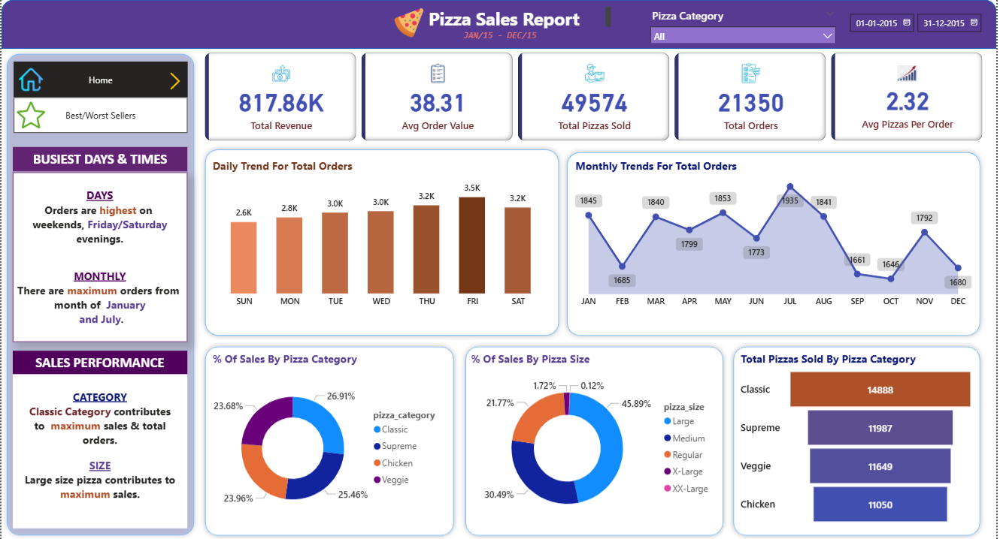
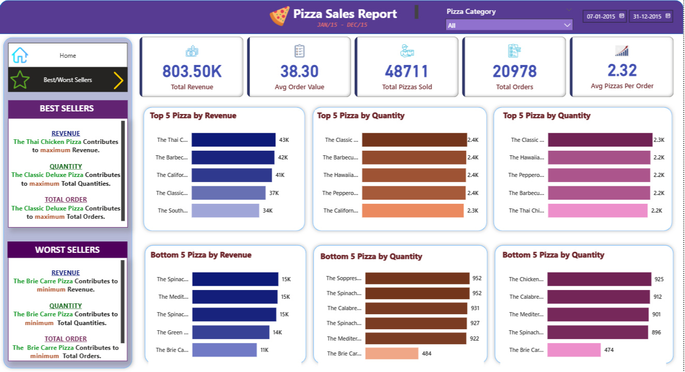
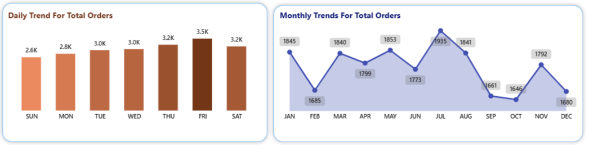
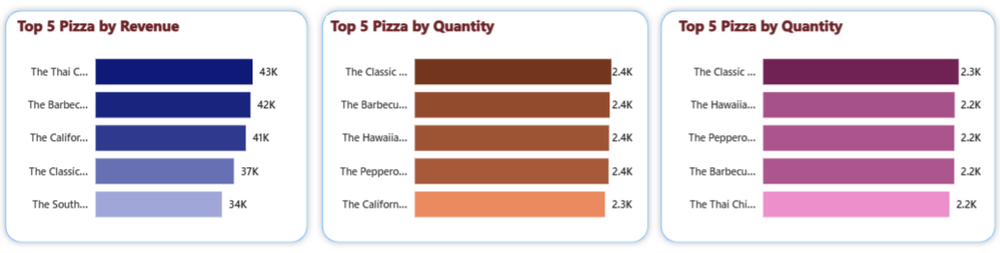
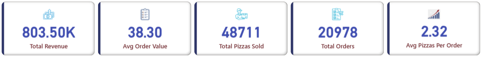

# 🍕 Pizza Sales Dashboard Practice Project (Power BI)

This is a practice project I completed by following a [Power BI tutorial on YouTube](https://youtu.be/V-s8c6jMRN0?si=WtgpeYkChLCJ4MHR). It helped me learn the end-to-end process of building an interactive dashboard to analyze pizza sales data — including data transformation, data modeling, DAX measures, and storytelling through visualizations.

---

## 📊 Project Overview

This Power BI dashboard provides business insights into a pizza company’s performance, highlighting:

- 💰 Total Revenue and Average Order Value  
- 📈 Sales Trends by Day and Hour  
- 🍕 Top-Selling Pizzas  
- 📦 Sales Breakdown by Pizza Size and Category  
- 🔍 Interactive filters for deeper analysis

It’s built as a portfolio learning project to strengthen my Power BI and data analysis skills.

---

## 🖼️ Dashboard Snapshots

### 🔹 Full Dashboard View  
####  Home Page

####  Best Seller and Worst Seller Page

### 🔹 Sales Trends  

### 🔹 Top Pizzas  

### 🔹 KPIs

---

## 📁 Project Structure

| File/Folder | Description |
|-------------|-------------|
| `Pizza_Sales_Dashboard.pbix` | Power BI file containing the report |
| `pizza-sales-dashboard-snapshots` | Dashboard screenshots |
| `README.md` | Project documentation |
|  `pizzasales.csv` | Source data used in the project  |

---

## 🛠️ How It Was Built

### 1. **Data Extraction & Transformation**

- Imported pizza sales data directly from **SQL Server**  
- Previewed data using **SQL Server Management Studio (SSMS)**  
- Used **Power Query Editor** for:
  - Data cleanup (nulls, duplicates)  
  - Time-based columns (order hour, weekday)  
  - Standardizing pizza sizes and categories

### 2. **Data Modeling**
- Built a star schema with:
- Fact table: `pizza_sales`
- Dimension tables: `date`, `category`, `size`, `pizza`
- Created relationships and optimized the model

### 3. **DAX Measures**

Total Revenue = SUM(pizza_sales[total_price])
Total Orders = DISTINCTCOUNT(pizza_sales[order_id])
Average Order Value = [Total Revenue] / [Total Orders]
Total Pizzas Sold = SUM(pizza_sales[quantity])
Average Pizzas per Order = [Total Pizzas Sold] / [Total Orders]

### 4. **Visualization**

📈 Line charts for daily and hourly trends  
📊 Bar charts showing top 5 pizzas by revenue and quantity  
🍩 Donut charts for size and category distribution  
🎚️ Slicers for interactive exploration  
🎨 Clean layout and color-coded themes for better readability  

---

### 🧰 **Tools Used**

- Power BI Desktop  
- SQL Server Management Studio (SSMS)
- Power Query Editor  
- DAX (Data Analysis Expressions)  
- Data Modeling (Star Schema)  
- Data Visualization & Storytelling  

---

### 🎯 **Key Learnings**

- Importing and transforming data using Power Query  
- Structuring an efficient data model using relationships  
- Writing DAX formulas to calculate KPIs  
- Designing clean, business-focused dashboards  
- Communicating insights through visuals  

---

### **🎓 Tutorial Credit**

This practice project is based on the tutorial by **Data Tutorial** on YouTube:  
📹 [Watch the full tutorial](https://youtu.be/V-s8c6jMRN0?si=WtgpeYkChLCJ4MHR)

---

### **📬 Contact Me**

📧 Email: pavithrabhaskar.tech@gmail.com  
💼 LinkedIn:[linkedin.com/in/pavithrabhaskar](https://www.linkedin.com/in/pavithrabhaskar/)

---

🖤 *Appreciate your time! Feedback is always welcome as I continue improving my data skills.*

